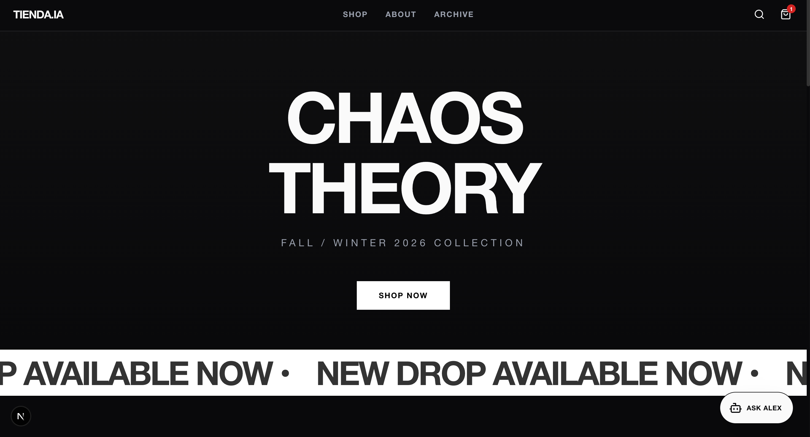
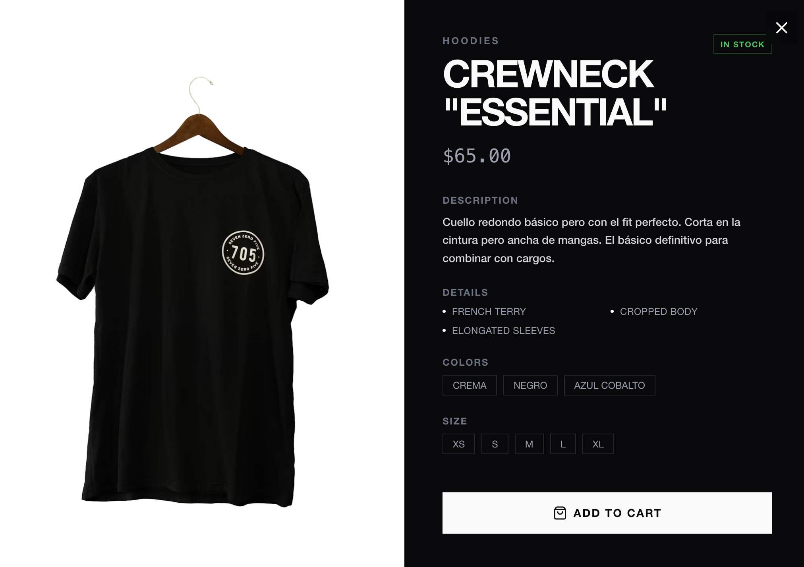

# TIENDA.IA | E-COMMERCE DE STREETWEAR



## Visión General

### [Acceder a Tienda.IA](https://tiendawithia.vercel.app) 


Tienda.IA redefine la experiencia de compra online mediante la integración profunda de **Inteligencia Artificial Generativa**. A diferencia de los e-commerce tradicionales, nuestra plataforma no solo muestra productos, sino que **entiende** lo que buscas.

El núcleo de Tienda.IA es "Alex", un agente de IA sofisticado que actúa como tu Personal Shopper, capaz de analizar tus intenciones, explicar tecnologías textiles y gestionar tu carrito de compras de forma autónoma.

## Potencia de la IA (Alex)

Alex no es un chatbot estándar. Utiliza una arquitectura de **"Global Context" (Memoria Total)** optimizada para máxima precisión en catálogos boutique:

1.  **Inyección de Contexto Global**: A diferencia de los sistemas RAG complejos, Alex recibe el catálogo *completo* (16 productos exclusivos) directamente en su memoria inicial. Esto le permite razonar sobre *todo* el inventario simultáneamente para crear outfits complejos sin latencia de búsqueda.
2.  **Ask Alex Integration**: Integrado directamente en las fichas de producto. Puedes pulsar "👟 Ideas de Outfit" o "🧵 Detalles" para abrir el chat con el contexto del producto ya cargado.
3.  **Lógica de "Fuzzy Matching" 🕵️‍♂️**: El sistema entiende errores tipográficos y traducciones (ej: "Botas Stomp" -> `Combat Boots "Stomp"`) para gestionar el carrito sin frustrar al usuario.
4.  **Filtro UI Inteligente**: La interfaz solo muestra las tarjetas de producto que la IA menciona explícitamente en su respuesta, manteniendo el chat limpio.

### ¿Qué puede hacer Alex?

1.  **Búsqueda Semántica e Intencional**:
    *   No necesitas saber el nombre exacto del producto. Puedes decir: *"Busco algo para un evento"*.
    *   Alex interpretará tu petición y buscará en el inventario productos que coincidan con ese *vibe*, estilo o necesidad técnica.

2.  **Asesoramiento Técnico Experto**:
    *   ¿Dudas sobre el material? Pregúntale: *"¿Qué significa 400gsm en la hoodie?"* o *"¿Estos pantalones sirven para la lluvia?"*.
    *   Alex conoce las especificaciones de cada prenda y te explicará los beneficios de los tejidos, cortes y acabados.

3.  **Gestión Autónoma del Carrito**:
    *   Alex tiene "manos". Puede añadir productos a tu carrito directamente.
    *   **Validación Inteligente**: Si le dices *"Añade los pantalones paracaídas"*, Alex verificará si has especificado talla y color. Si no, te preguntará antes de actuar, asegurando que no cometas errores en tu pedido.

4.  **Personalidad de Marca**:
    *   Alex ha sido condicionado para comportarse como un experto en streetwear. Su tono es profesional pero relajado, alineado con la estética de la marca. No usa emojis y va directo al grano.



## Características Adicionales

### Catálogo Moderno y Validado
*   **Categorías**: Sudaderas, Camisetas, Pantalones, Chaquetas, Zapatos y Accesorios.
*   **Filtrado Instantáneo**: Navegación fluida sin recargas.
*   **Validación de Compra**: El botón "Añadir al Carrito" permanece bloqueado hasta que el usuario selecciona talla y color, evitando fricciones en el checkout.

### Experiencia Editorial "Archivo"
*   Una sección inmersiva que va más allá de la venta. "Archivo" presenta editoriales de moda, manifiestos de marca y diarios visuales, construyendo una narrativa sólida alrededor de los productos.

## Stack Técnico

*   **Inteligencia Artificial**: Groq (Llama 3.3 70B) - Ultra baja latencia.
*   **Frontend**: Next.js 15 (App Router) y React.
*   **Estilos**: Tailwind CSS con diseño "utility-first".
*   **Animaciones**: Framer Motion para micro-interacciones.
*   **Estado**: React Context API.

## Seguridad y Configuración

El proyecto sigue estrictos protocolos de seguridad para proteger las credenciales de IA:
*   Las **API Keys** se gestionan exclusivamente en el servidor (`.env.local`).
*   El sistema de prompts incluye directrices de seguridad para evitar que la IA se desvíe de su rol de vendedor.

## Guía de Instalación

1.  **Clonar el repositorio**:
    ```bash
    git clone https://github.com/tu-usuario/tienda-ia.git
    ```
2.  **Instalar dependencias**:
    ```bash
    npm install
    ```
3.  **Configurar Variables de Entorno**:
    Crea un archivo `.env.local` y añade tu clave:
    ```env
    GROQ_API_KEY=tu_clave_api_aqui
    ```
4.  **Desplegar**:
    ```bash
    npm run dev
    ```

---
*Tienda.IA es un proyecto Open Source bajo licencia MIT.*
